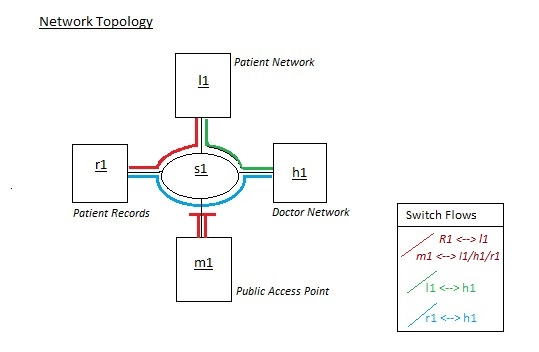
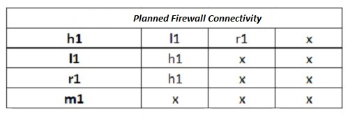

Utilising an SDN to Secure an IOT network in a Medical Setting 
CSC7078_KevinBrolly_40313770

Project Scenario
A healthcare centre would like to implement IoT devices into their patient 
monitoring infrastructure as an RFID based patient chart due 
to the inexpensive nature and speed of deployment, they are keen to implement. 

However there have been concerns deploying such devices due to issues 
concerning security, data protection, service continuity and monitoring.

Areas of concern utilising IOT devices includes:
- Lack of device support via firmware/security updates. 
- Weak / default credentials. 
- Device specification limits inbuilt security measures. 
- Issues of maintainability. 
- Due to the inexpensive nature the number of devices 
- Can exponentially grow quickly.

These issues provide malicious actors attack vectors to the health 
centres business network, affecting service and potentially 
compromising patient information and safety.

Network Topology
I have defined a network to demonstrate my Firewall solution.
There is a single switch connecting four networks, as demonstrated in the image 
below

- s1 represents Switch 1
- h1 represents the Doctor Network.
- l1 represents the Patient Network.
- r1 represents the network hosting Patient Records.
- m1 represents a Public Access Point for patients and visitors.

Attack Type
Firewalls can be utilised to protect a network from network-based 
security threats. This firewall implementation prevents the delivery
of packets to hosts attempting to exchange packets in a non-white 
listed method as defined by the RYU controllers flow roles. 

A firewall limits the capability and scope of a malicious actor’s attack
vector by creating rules governing the interconnectivity of devices 
connected to the business network depending on the hosts network. 
In the example developed in this repository the firewall application:

- Traffic from Doctor Network (h1) hosts may be exchanged with Patient 
Record Network (r1) hosts.
- Traffic from Doctor Network  (h1) hosts may be exchanged with Patient
Network (l1) hosts.
- Traffic from Patient Network (l1) hosts may  not be exchanged with the
Patient Record Network (r1) hosts.
- Traffic generated from Patient Network Public Access Network (m1) hosts
- may not be exchanged with hosts from the three other networks (h1,l1,r1).

Proposed Solution
I have implemented a Packet-filtering firewall, utilising flow roles in the RYU 
controller to filter packets based on their ip source and destination. 
Any inbound packets that do not meet the criteria of the flow roles are dropped,
I have developed a whitelist defining allowed traffic.

A benefit of using such an implementation is that it is not resource intensive 
and should have a low impact on system performance an important factor when 
considering the scalability of IoT devices.

This firewall is stateless, only analysing packets in isolation, 
impacting the overall level of protection it can provide as vulnerabilities 
may be exploited to bypass these conditions. 

Ideally a multi-layered approach to network security would be implemented,
however this is a demonstration of the firewall, further aspects are 
discussed in the repository.

Evaluation Plan
- To test the effectiveness of the solution I will be generating traffic within 
the network utilising the firewall scenario to see if the flow roles are 
implemented and correct traffic dropped. As depicted below:

- After instantiating my configured firewall application utilise the 
pingall command to compare against the expected network connectivity.

- Finally iperf will be utilised to measure the tcp bandwidth 
of the connected networks.  

Repository Structure:
- Application
 	- /Dev– wip dev, future  etc
 	- Cockpit.py
 	- Configured.py (The configured firewall developed)
 	- Unconfigured.py (No flow roles instantiated)
- Guides
 	- 1_SDNCockpitInstallManual.pdf (Instructions from the original repo)
 	- 2_SDNCockpitProjectLaunchGuide.pdf (How to launch the firewall guide)
 	- 3_ProjectFileLocations.pdf (Where to place the firewall files)
- Results
 	- Performance_Tests.pdf  (iperf test results on configured firewall network)
 	- Results.pdf  (scenario results - configured.py and unconfigured.py)
- Scenario
 	- /futuredev  (Future development plans)
 	- /testbed  (firewall development)
 	- firewall.yaml  (recent firewall scenario)
- SolutionAnalysis
 	- Improvements&FurtherDevelopments (implementation analysed)
- Task
 	/dev ( firewall scenario development folder)
 	firewall.yaml (recent firewall scenario)
- Readme_Images
 	- firewallConnectivity.jpg
 	- networkTopology.jpg

